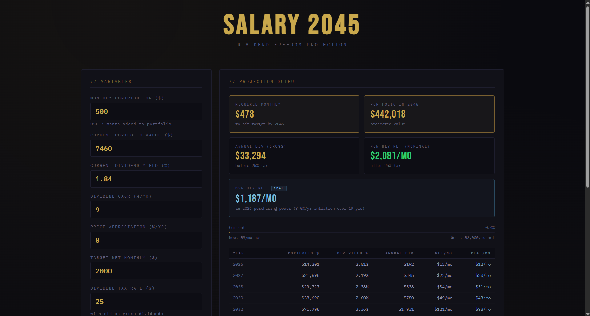
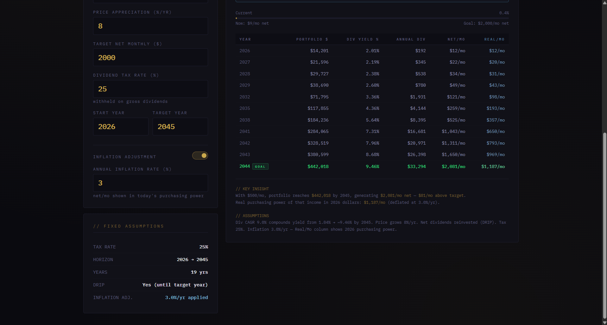

# 💰 SALARY 2045 — Dividend Freedom Projection

> **A personal financial modeling tool for tracking the path to dividend-based income freedom.**  
> Built for long-term investors who want a clear, realistic roadmap — with inflation-adjusted math included.

---


---

## 📸 Screenshots

| Full Dashboard | Year-by-Year Breakdown |
|:-:|:-:|
|  |  |

---

## 🎯 What Is This?

**Salary 2045** is a single-file HTML financial projection tool. You input your current portfolio details and contribution plan, and it tells you:

- When you'll hit your target passive income (your "dividend salary")
- How much you need to contribute monthly to get there by a specific year
- What your income looks like after taxes
- What that income is actually worth after inflation (real purchasing power)

No backend. No accounts. No ads. Just math in a browser.

---

## 🚀 Features

### 1. 📊 Full Projection Table
Year-by-year breakdown from your start year to your target year, showing:
- **Portfolio Value** — total accumulated capital
- **Dividend Yield %** — yield-on-cost as dividends grow over time
- **Annual Dividends (Gross)** — total dividend income before tax
- **Net/Mo** — monthly income after tax (nominal)
- **Real/Mo** *(optional)* — monthly income adjusted for inflation (in today's purchasing power)

Rows are smart-sampled to keep the table readable — early years, milestones, and the goal year are always shown.

---

### 2. 🎯 Required Monthly Contribution Calculator
The tool uses **binary search** to find the exact monthly contribution needed to hit your target net income by your target year. You enter your current contribution, and it tells you if you're on track or what you'd actually need.

---

### 3. 🧾 Tax Modeling
Input your dividend tax rate (e.g. 25%) and all calculations apply it automatically:

- **Gross dividends** = raw portfolio yield × portfolio value
- **Net dividends** = Gross × (1 − tax rate)
- **Net/Mo** = Net dividends ÷ 12

This is applied at every year of the simulation, so you always see what you actually keep.

---

### 4. 📉 Inflation Adjustment (Real Purchasing Power)
Toggle inflation adjustment on to see what your future income is actually worth in today's money.

**Formula used:**

```
Real Monthly = Net Monthly ÷ (1 + inflation_rate) ^ years_elapsed
```

**Example:**  
$2,081/mo nominal in 2044 at 3%/yr inflation over 18 years → **$1,187/mo in 2026 purchasing power**

This is the difference between *looking rich on paper* and *actually being able to buy the same things*. The Real/Mo column is the honest number.

---

### 5. 📈 Progress Bar
Visual progress indicator showing where you are right now as a percentage of your target:

```
Progress % = (Current Net Monthly ÷ Target Net Monthly) × 100
```

It uses your current portfolio value and yield to calculate where you stand today — not where you'll be.

---

### 6. 🔁 DRIP (Dividend Reinvestment)
Until the target year is reached, net dividends are fully reinvested. This is baked into the portfolio growth formula at every simulation step.

---

## ⚙️ How the Simulation Works

The core simulation runs year by year. Here's the exact logic:

### Step-by-Step (per year):

```
1. avgPort = portValue + (monthly × 12 × 0.5)
   — approximates that contributions arrive spread throughout the year

2. divGross = avgPort × divYield
   — raw dividends generated this year

3. divNet = divGross × (1 - TAX)
   — after-tax dividends

4. portValue = portValue × (1 + priceGrowth) + (monthly × 12) + divNet
   — new portfolio value: price appreciation + annual contributions + DRIP

5. divYield = min(divYield × (1 + divCAGR), 0.15)
   — yield grows with dividend CAGR, capped at 15% to avoid unrealistic compounding

6. netMonthly = divNet ÷ 12
   — monthly take-home

7. realMonthly = netMonthly ÷ (1 + inflation)^year
   — real purchasing power (only shown when inflation toggle is on)
```

### Dividend Yield Cap
The simulation caps yield at **15%** to prevent the model from drifting into fantasy territory. In practice, a quality dividend growth portfolio hitting 15% yield-on-cost is already exceptional compounding.

---

## 🧮 Input Parameters

| Parameter | Description | Default |
|---|---|---|
| Monthly Contribution | Amount added to portfolio each month | $500 |
| Current Portfolio Value | Starting portfolio balance | $7,460 |
| Current Dividend Yield | Portfolio's current yield (%) | 1.84% |
| Dividend CAGR | Annual dividend growth rate | 9% |
| Price Appreciation | Annual portfolio price growth | 8% |
| Target Net Monthly | Monthly income goal after tax | $2,000 |
| Dividend Tax Rate | Withheld on gross dividends | 25% |
| Start Year | Simulation start | 2026 |
| Target Year | Goal deadline | 2045 |
| Inflation Rate *(optional)* | For real purchasing power calc | 3% |

---

## 📌 Key Assumptions & Limitations

**What this tool assumes:**
- Contributions arrive evenly throughout the year (averaged at midpoint)
- DRIP is active — all net dividends are reinvested until the target year
- Dividend yield compounds at a constant CAGR (real portfolios are messier)
- Price appreciation is constant year-over-year (also not realistic, but directionally useful)
- Tax rate is flat — doesn't account for progressive brackets or different rates per country

**What this tool does NOT do:**
- Track individual stocks
- Account for dividend cuts or suspension
- Model market crashes or sequence-of-returns risk
- Adjust contributions for your own inflation (your cost of living rising over time)
- Replace a financial advisor

**Use it as a directional planning tool, not as a financial forecast.**

---

## 📂 File Structure

```
salary2045_projection.html   ← Everything. One file. No dependencies.
```

No npm. No build step. No frameworks. Open it in a browser and it works.

The only external dependency is Google Fonts (loaded via CDN):
- `Bebas Neue` — display headings
- `IBM Plex Mono` — data and labels
- `IBM Plex Sans` — body text

---

## 🖥️ How to Use

1. Download `salary2045_projection.html`
2. Open it in any modern browser (Chrome, Firefox, Safari, Edge)
3. Edit the input fields on the left panel — the projection updates instantly
4. Toggle **Inflation Adjustment** to see real vs nominal income
5. Read the **Key Insight** section at the bottom for a plain-language summary

---

## 🗺️ Roadmap / Potential Additions

- [ ] Export projection table to CSV
- [ ] Chart visualization (portfolio growth curve + dividend curve)
- [ ] Scenario comparison (bull / base / bear)
- [ ] Multiple income targets at different years
- [ ] Israeli tax bracket support (for Israeli investors with 25% + credit)
- [ ] Mobile-optimized layout

---

## 📜 License

MIT — use it, fork it, modify it. No attribution required, but appreciated.

---

*Built for personal use. Numbers are projections based on assumptions — not guarantees.*
